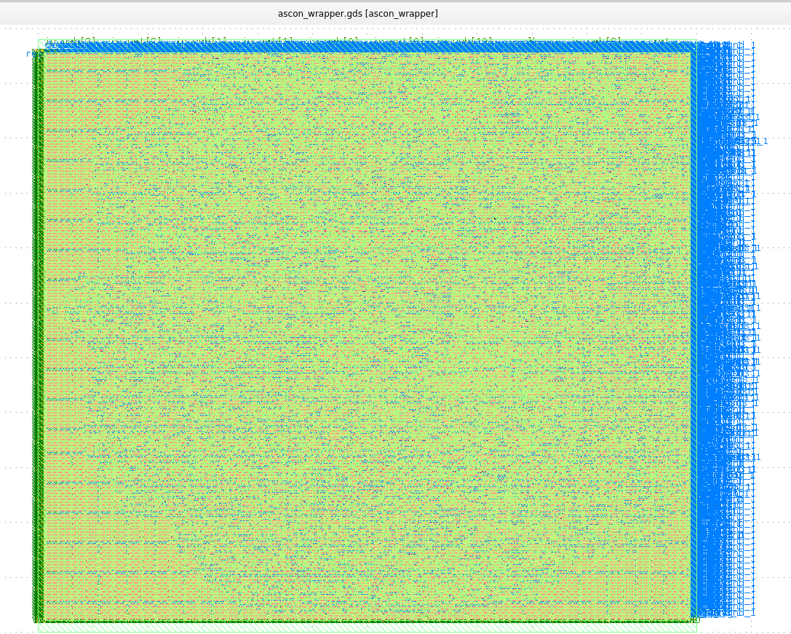
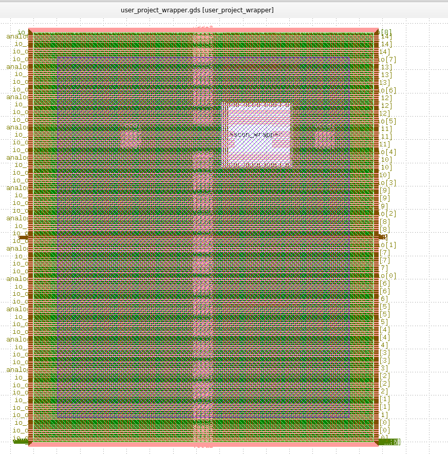

# Caravel User Project 

[](https://opensource.org/licenses/Apache-2.0) [](https://github.com/efabless/caravel_project_example/actions/workflows/user_project_ci.yml) [](https://github.com/efabless/caravel_project_example/actions/workflows/caravel_build.yml)

# Design and Implement ASCON Core Encryption and Decryption (VKU)
Design and implement a lightweight cryptographic core based on the ASCON algorithm for encryption and decryption

# Environment Setup
## Prerequisites
I'm using WSL (Ubuntu 20.04) if You do not have WSL installed please install here: [Install WSL or Ubuntu](https://documentation.ubuntu.com/wsl/en/latest/guides/install-ubuntu-wsl2/). 
 And I'm using Python 3.8.10
## Digital design tools on Linux or WSL using Docker
### Install Docker
If you don't have docker please install: [Install Docker](https://docs.docker.com/engine/install/ubuntu/). And And note that you must Add user to docker group `sudo gpasswd -a $USER docker`
### Pull docker image
After Docker has been successfully installed, we can use `docker pull` command to download the docker image from the Internet into our computer:
```sh
docker pull efabless/openlane:latest
```
### Install volare to manage the `PDK`
The Docker image for Openlane does not contain the PDK. Therefore, we have to install volare to download and install the `PDK`. Volare can be installed using the following command:
```sh
python3 -m pip install --upgrade --no-cache-dir volare
```
Volare will be installed into your home directory (`$HOME/.local/bin`). I recommended to add $HOME/.local/bin into your program search path:
```sh
echo 'export PATH=$HOME/.local/bin:$PATH' >> .bashrc
source .bashrc
```
We can test if volare has been successfully installed
```sh
volare --verison
```
If you see `volare, verison 0.xx.x (example 0.18.1)`
### Setup the environment variables to install the `PDK`
Setup the `PDK_ROOT` and download the `PDK` using volare:
```sh
export PDK_ROOT=$HOME/unic-cass/pdks
export PDK=sky130A
volare ls-remote --pdk sky130
```
### Download the latest PDK using volare
You look for the latest version of it, it usually appears on the first line. And the command download:
```sh
volare enable --pdk sky130 0fe599b2afb6708d281543108caf8310912f54af
```
## Running the ASCON Core
First, You need to run setup caravel_user_project:
```sh
make setup
```
Then, You run the following command so the program can create the layout design of ascon:
```sh
export PDK=sky130A
make hs_ascon
```
Finally, after waiting about 1 hour, run the following command to open ascon's layout:
```sh
export PDK=sky130A
export PDK_ROOT=$HOME/uniccass_example/dependencies/pdks
klayout `find openlane/hs_ascon/runs -iname "*.gds" | grep 'final.*\.gds' | head -n 1`
```
And here is the Layout of ASCON core when it is finished running  


If you do not have Klayout please install: [Install Klayout](https://gist.github.com/flaport/ad2bf1cab692bdd12484d64065ca0b5c)

## Run integration into Caravel SoC
If you want to a layout with integration into Caravel SoC, you will run the following command: 
```sh
make user_project_wrapper
```
Similar to Ascon Core to open the layout:
```sh
klayout `find openlane/user_project_wrapper/runs -iname "*.gds" | grep 'final.*\.gds' | head -n 1`
```
And the layout when integration into Caravel SoC:  



# Further Work
For the Ascon project, speed optimization will be achieved in two stages. First, at the RTL level, techniques like pipelining and loop unrolling will be used to improve data processing speed. Then, during physical design optimization, layout and routing will be refined to minimize delays and power consumption, ensuring efficient performance.
# Contributors
1) Ly Huu Loc, Student,  Vietnam–Korea University of Information and Communication Technology – VKU, loclh.21ce@vku.udn.vn
2) Ho Minh Phi, Student, Vietnam–Korea University of Information and Communication Technology – VKU, phihm.21it@vku.udn.vn
3) Le Trong Quyen, Student, Vietnam–Korea University of Information and Communication Technology – VKU, quyenlt.21ce@vku.udn.vn
4) Luu Quang Vu, Student, Vietnam–Korea University of Information and Communication Technology – VKU, vulq.21ce@vku.udn.vn
5) Dang Anh Cuong, Student, Vietnam–Korea University of Information and Communication Technology – VKU, cuongda.21ce@vku.udn.vn
# Acknowledgements
1) Duy-Hieu Bui, PhD Vietnam National University, Hanoi
2) Vietnam–Korea University of Information and Communication Technology – VKU

